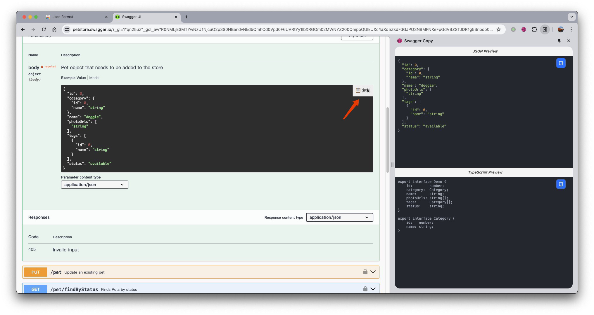
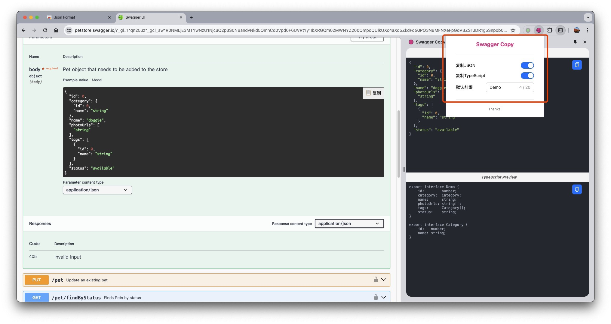

# Swagger UI JSON Quick Copy

- add a button to swagger ui page.
- copy sample data to clipboard.
- open the chrome sidepanel to view source data and typescript interface

- config copy rule: only json,only ts,change ts interface name.
